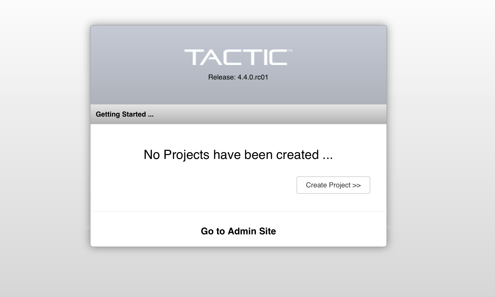
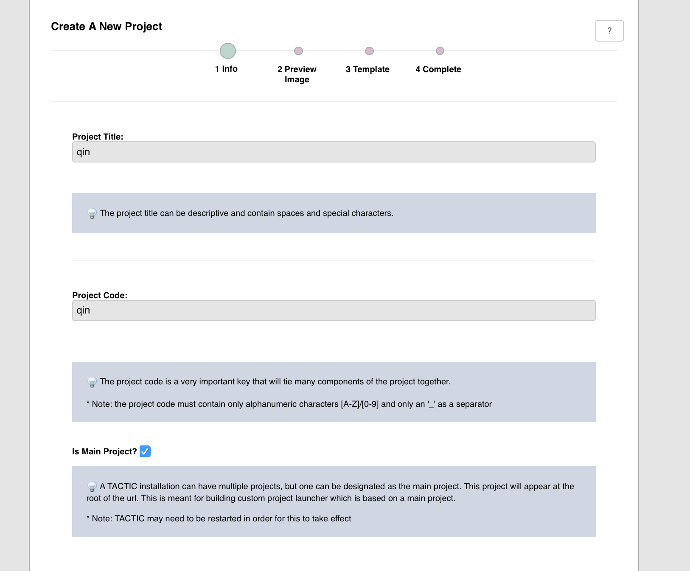
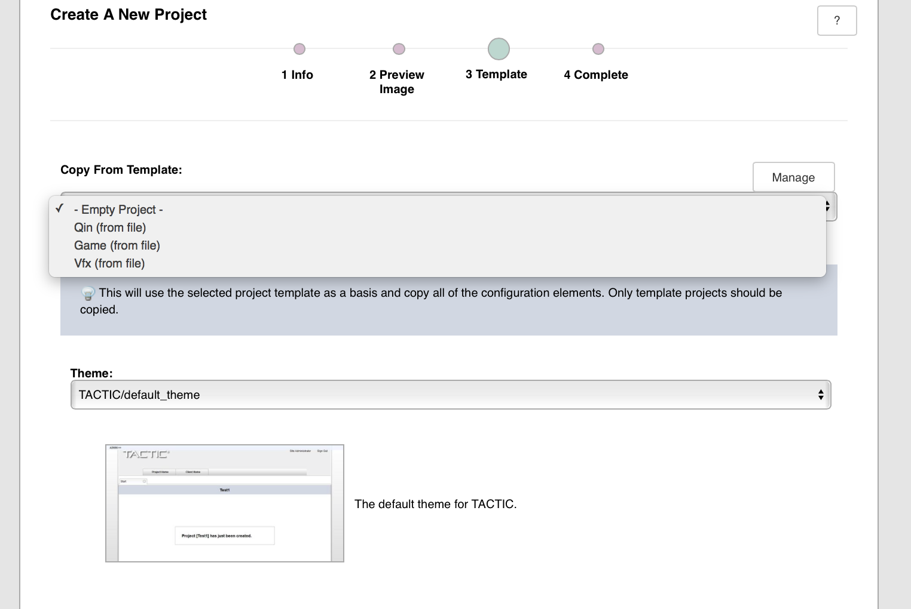
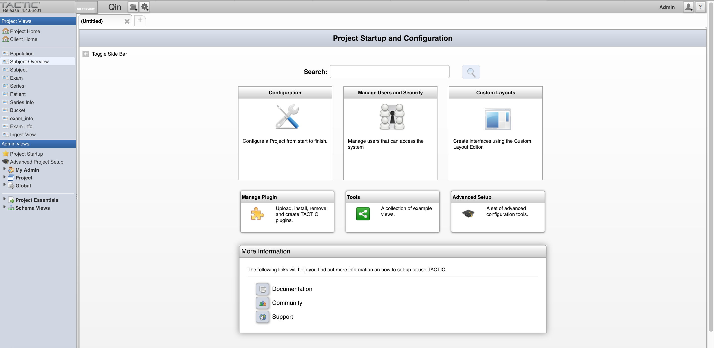

# Documentation

This repository contains the basic elements for the content management system of PESSCARA.

## Basic Information

Things included:

- A Tactic instance than can be deployed based o a docker file:

	> To deploy follow the steps be executing the commands:
	> 1. **docker build .** ( This will take some time)
	> 2. **docker images** (Will list all the images select the most recent one)
	> 3. **docker run -d -p 10080:80 -p 10081:22 -e ROOT_PASSWORD="my_secure_root_password" {imageID}}**

	> Tactic is up and running, you can visit localhost:10080 and start setting up the project details or ssh to your docker by **ssh root@localhost -p 10081** or shell access.

- The tactic client library (*tactic_client_lib*)

- A wrapper library to simplify interaction based on our predefined schema (*tiPY*)


## Creating a Project

We have created a project schema suitable for medical image analysis.The file name of the current schema is:

    ```qin-1.0.0.zip```


Modified or newly created schema can be exported and reused in new installations as template.Modifications can be perform utilizing the web interface.The location of the template in our docker image is:

    ```/home/apache/tactic_data/templates```

Some default TACTIC templates are also available.


Visit [http:\/\/localhost:10080](http://localhost:10080)

This is the default port forwarding for the VM in case port is changed, modify accordingly.Here is a screenshot.

First step is set an account.


If the project files are copied to the system go ahead and create the project







If all the steps done correctly the output should be:



## Stop and remove all docker images 
docker stop $(docker ps -a -q)
docker rm $(docker ps -a -q)
#### Delete all images
docker rmi $(docker images -q)
